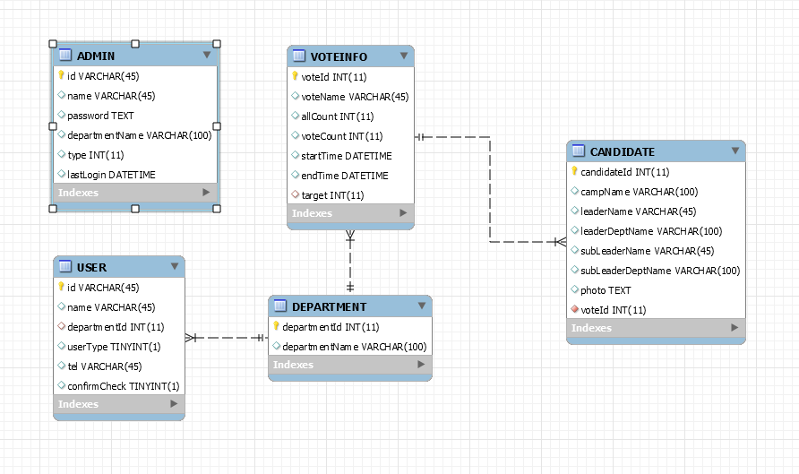

# Project Skhu Vote System
### 성공회대 선거시스템
* 마이크로 서비스 아키텍쳐, 3개의 서비스 서버로 구성<br/>
**선거 및 선관위 관리 시스템** / 투표 시스템 / 선거 정보 조회 시스템<br/>
프로젝트 기간 : 2017년 겨울방학<br/>

* 작품 제안서 : [SKHU VOTE SYSTEM 작품제안서](./document/skhuvote_manual.pdf)
* Api Manual
    * [AdminController](./apidoc/AdminController.md)
    * [AdminManageController](./apidoc/AdminManageController.md)
    * [CandidateController](./apidoc/CandidateController.md)
    * [ElectionController](./apidoc/ElectionController.md)
    * [UserManageController](./apidoc/UserManageController.md)

## 시작하기

* pom.xml

```
<dependencies>
    <dependency>
        <groupId>org.springframework.boot</groupId>
        <artifactId>spring-boot-starter-data-jpa</artifactId>
    </dependency>
    <dependency>
        <groupId>org.springframework.boot</groupId>
        <artifactId>spring-boot-starter-web</artifactId>
    </dependency>

    <dependency>
        <groupId>mysql</groupId>
        <artifactId>mysql-connector-java</artifactId>
        <scope>runtime</scope>
    </dependency>
    <dependency>
        <groupId>org.projectlombok</groupId>
        <artifactId>lombok</artifactId>
        <optional>true</optional>
    </dependency>
    <dependency>
        <groupId>org.springframework.boot</groupId>
        <artifactId>spring-boot-starter-tomcat</artifactId>
        <scope>provided</scope>
    </dependency>
    <dependency>
        <groupId>org.springframework.boot</groupId>
        <artifactId>spring-boot-starter-test</artifactId>
        <scope>test</scope>
    </dependency>
    <!-- 엑셀 -->
    <dependency>
        <groupId>org.apache.poi</groupId>
        <artifactId>poi</artifactId>
        <version>3.11</version>
    </dependency>
    <dependency>
        <groupId>org.apache.poi</groupId>
        <artifactId>poi-ooxml</artifactId>
        <version>3.11</version>
    </dependency>
    <!-- MultipartHttpServletRequset -->
    <dependency>
        <groupId>commons-io</groupId>
        <artifactId>commons-io</artifactId>
        <version>2.0.1</version>
    </dependency>
    <dependency>
        <groupId>commons-fileupload</groupId>
        <artifactId>commons-fileupload</artifactId>
        <version>1.2.2</version>
    </dependency>
    <!-- JSON Web Tokens -->
    <dependency>
        <groupId>io.jsonwebtoken</groupId>
        <artifactId>jjwt</artifactId>
        <version>0.9.0</version>
    </dependency>
    <!-- https://mvnrepository.com/artifact/org.springframework.cloud/spring-cloud-aws-context -->
    <dependency>
        <groupId>org.springframework.cloud</groupId>
        <artifactId>spring-cloud-aws-context</artifactId>
        <version>1.2.2.RELEASE</version>
    </dependency>
    <!-- https://mvnrepository.com/artifact/org.springframework.cloud/spring-cloud-aws-autoconfigure -->
    <dependency>
        <groupId>org.springframework.cloud</groupId>
        <artifactId>spring-cloud-aws-autoconfigure</artifactId>
        <version>1.2.2.RELEASE</version>
    </dependency>
    <dependency>
        <groupId>org.springframework.boot</groupId>
        <artifactId>spring-boot-configuration-processor</artifactId>
        <optional>true</optional>
    </dependency>
</dependencies>
```

## 배포

* AWS EC2
* AWS RDS

## 사용된 도구

* Spring Boot + JPA
* JWT : 사용자 권한
* Maven - 의존성 관리 프로그램
* MySQL : 주 데이터베이스
* Tomcat : 웹 애플리케이션 서버
* IntelliJ
* AWS EC2
* AWS RDS

## 저자

* **조민국** - [MinGOODdev](https://github.com/MinGOODdev)

## 감사 인사

* [CORS](http://homoefficio.github.io/2015/07/21/Cross-Origin-Resource-Sharing/)
* [Cross Domain API 서버 구성](https://www.popit.kr/corss-domain-api-%EC%84%9C%EB%B2%84-%EA%B5%AC%EC%84%B1/)
* [HTTP 접근 제어(CORS)](https://developer.mozilla.org/ko/docs/Web/HTTP/Access_control_CORS)
* [JSON Web Token 소개 및 구조](https://velopert.com/2389)
* [Spring Boot 환경에서 JWT 사용하기](http://alwayspr.tistory.com/8)


## 수상

* 2018년 제10회 성공회대 소프트웨어공학과 경진대회 자유주제 1위

---


